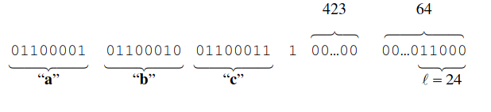

# Aaron Burns - G00346688
## Overview of the MD5 Hashing Algorithm Project

# Introduction
The requirement for this project was to create a *C* program that would calculate the hash value of a input using the Message Digest 5 (MD5) algorithm. It required learning about how the algorithm processes the message before it can be hashed as well as generating the output hash value of that message. The research involved in this project was extensive and essential to understanding and creating the hashing program. There was a large number of sources detailing the algorithm for MD5, however not so many detailing how the preprocessing, or padding in this case was done. Sources would assume you knew or barely mention the padding and how it is done. Luckily The Secure Hashing Algorithm 256 (SHA256) shares the exact same padding process and their is a very detailed summation of how to implement it and how it works. I will get into more detail on the algorithm and its components in later sections, but I felt it nesscessary to mention how researching one hashing algorithm can help with building another. The MD5 algorithm itself is documented in the *C* language, this made it very easy to interpret the code samples provided in the various sources found online(list of sources and what they were used for are in the Research Section). 

When is comes to understanding the MD5 hashing algorithm, there are a number of things to keep in mind. The input for the hashing algorithm is called a *"message"*. MD5 can hash practically any input of any size. Theoretically there is a limit to the size of the input. But it is unrealistic that a message that large would be ever need to be hashed. Regardless of the size of the input, the output which is known as the *"hash" or "digest"* will always be the same size. That size being 128-bits or 16-bytes, which if put into a string would have a lenght of 32. An example of what a hash value looks like is: *5d41402abc4b2a76b9719d911017c592*, this is the hash output of the message "hello". It is important to know that one little change in the word "hello" will change the **digest(output) of the message(input)** completely, for example: *8b1a9953c4611296a827abf8c47804d7* is the hash output for "Hello". Just by changing the case of the first letter you get a completely different hash value as an output.

The other important thing to keep in mind when learning to build a hashing algorithm is why hashing is used to secure passwords, or documents. A hash of any input will always be the same as long as the input doesn't change. It is a way of securing whatever the input may be in a way that doesn't require the host that is saving the information to actually know what the unhashed digest is. Lets say the message is a password to a website. The website should not store the actually message itself. If the website is hacked then the password is there for people to steal. However if the website stores hash values of the passwords and the site is hacked all they will have are the hash values. This is more secure because it is next to impossible to recreate the original input from the hash value. That is what makes hashing algorithms very useful and important when securing information. 

# Run

## On Windows(10)

### How to set up

Go to [MSYS2 Website](https://www.msys2.org/), and click the download which is recommended for your system. (The website will tell you which one is recommended).

Onces it's downloaded, follow the Windows installer process until it is finished. It will open a cmd window similar to the windows CMD console.

Then update pacman(A package managing enviroment) using the following line in the CMD. Pacman makes it very easy to manage the installation of packages including the gcc
* pacman -Syu

Then install the gcc package by using the following line in the CMD
* pacman -S base-deve1 gcc vim cmake

In order to use the *C compiler* in the standard windows console, you need to add the the following enviroment variables(Search this term in the windows search bar) to the PATh in windows 10.
* C:\msys64\mingw64\bin
* C:\msys64\usr\bin

### CMD to Compile and Run

- gcc -o md5 MD5.c

- md5

## On Linux(Project built on)

### How to set up

Linux has embedded tools to compile *C* code and run *C* programs, use the following cmd line to install gcc 
- sudo apt install build-essential

This line is to verify if gcc is install, it will also tell you the version.
- gcc --version

### CMD to Compile and Run

- gcc -o md5 MD5.c

- ./md5 test.txt

# Test

# Algorithm
The MD5 algorithm itself is very complex and challeneging to get an understanding of. However there exist many resources online which can be used to better your understanding. From summaries of the algorithm along with Pseudo code ([Summary and Pseudo Code](http://practicalcryptography.com/hashes/md5-hash/)), to the offcial algorithm itself ([RFC-1321](https://datatracker.ietf.org/doc/rfc1321/?include_text=1)). The MD5 algorithm has many components that are used not only in the hashing process itself but in the padding process, there are also a number of constants that are used thoughout the program as well as other data types for storing the input. Every component of this program is used in either the padding process or the hashing process. Most of these components that are used in the hashing process which takes place **hashMD5** function such as the constants K and S (more on these later). However the input message itself is not stored as a static variable. It is store in a Union. The reason for this is because throughout the program the message needs to be read in different sizes of ints. And using a Union allows us to store the exact same data in different data types. I will go into more detail about how Unions are used in this project later.

## Constants and Other Data Types

### A,B,C,D
* These are the intial values, that will be assigned to the local variables a,b,c,and d in the **hashMD5** function. They do not change and are only used at the start of each hashing process in the program. These static values are called registers and are static 32 bit intergers.  

### K 
* K is a constant 32-bit integer array of size 64, each one of these ints is used in one of the 64 operations in the MD5 Algorithm. i.e. the first opertion uses the int at index 0 etc.

### S 
* S is a constant 2D array of ints that contains static values that are used in the bit shifting process (more on this later). These ints are used in the operations of the hasing process, the first row in the 2D array is used in the first round, and given that there are 16 operations per round the values in the columns are used 4 times each.

### Union
* The Union which is called **BLOCK** is used to allocate a total of 64-bytes of memeory to the input message, but not as a single data type, unions can be used to store and access the same memory as different data types. In the case of this program the total 64-bytes is store as: 
* 64 8-bit blocks: For Padding(the 0-bits and 1-sbit)
* 8 64-bit blocks: For Padding(the last byte)
* 16 32-bit blocks: For passing into and returning to/from the **hashMD5** function
Diagram of how the union looks and operates in memory.  

How the union looks in **Code**.  

## Padding
* The reason for storing the data in a **Union** which allows us to access the memory in different data types is because the padding requires the input message to manipulated in a way that would be more bothersome in terms of creating temporary variables to store the data while it's being padded. But by using a Union the data stay part of the same memory block but accessed in a type that that works better with the **padding process**. 
* The union is used in the **Padding** to make sure that the message is padded to the correct length, The correct length being equal to **448 % 512**.
* The padding process for MD5 works as follows. Every message has to be padded to the aforementioned length. This is why the input size doesn't matter when it comes to MD5, because no matter what size the input is, large or small, it will be padded until it is a size that is equal to the equation mentioned above.
* The end goal of the padding process is to ensure that the messages length in bits is equal to 448 % 512(essentailly it should be 64-bits shy of the Unions total memory). Padding is done on every message into the MD5 algorithm even if the total amounts of bits already matches what is required.
    1. The first part of the padding process is to append a single **1-bit** to the end of the message
    2. Then append as many **0-bits** as are needed to *ensure the message is congruent to 448 % 512*.
    3. A 64-bit representation of the length of original message is then appended.
* At the end of the padding process the message will look like the original message in bits + 1-bit + n 0-bits + A 64-bit block of the length of the message before pre padding. And it will match the size requirement needed for the MD5 algorithm.(*An example of how it may look is in the Padding Section of the* **README**)
* 'a', 'b', and 'c' are the original message in bits, then 1-bit followed by the 0-bits and finally the 64-bit Block of the lenght of the oringal message in bits.  

## Enum
* The PADDING enum is used to check what stage of the padding process is in. This is done to check if the what needed to be padded is the 1-bit, the 0-bit or the final 64-bits

## Auxillary Functions
* There are 4 Auxillary functions used in the MD5 algorithm. They are named F, G, H and I. Each of them are simple boolean return type functions that are used in each round of the hashing process.
* The F Auxillary Function is used in the first round of 16 operations.
* The G Auxillary Function is used in the second round of 16 operations.
* The H Auxillary Function is used in the third round of 16 operations.
* The I Auxillary Function is used in the final round of 16 operations.
The Functions operate as such:  

## Bit Shift Function
* The **ROTL**(Rotate Left) function is left bit shifting function that is coupled with every calling each Auxillary function. It is used to further manipulate the hash output even further then just using the Auxillary Functions alone.
* When each **Auxillary Function** regardless of which round the hashing process is in, The ROTL
is always called in unison with them, because of this the ROTL function is called in every operation of the hashing process.

## Hashing
* The MD5 hashing process which takes place in the **hashMD5** function is a series of 64 **Operations** which are divided up into 4 **Rounds** of 16 operations each. Each round is differentiated by using a different **Auxillary Function**. 
* Before the hashing operations begin, the initial hash values defined as A,B,C, and D are assigned to local variables which are then passed into the first operation, which begins the hash process. The function is not complete until these initial **registers** have been transformed into the correct hash output for what ever the message input was. 
* The registers are not the only inputs to operations, the Constant "K's" values is used one to one with each operation, and a variable "s" which is used to access elements of the "S" constant which is used for the bit shifting function **ROTL**.
* The final parameter added to the operations is the padded message from the Union in its 32-bit integer type. The 32-bit integers from the union are stored in a 16 size array, this is perfect for the number of operations in each round of the hashing process.  

# Research

* [gcc for Windows](https://youtu.be/0Z4Xga_7gp0): Video used for installing *C Compiler* for Windows.

* [Practical Cryptography](http://practicalcryptography.com/hashes/md5-hash/): Practical Cryptography website used for learning about the broad aspects of MD5 algorithm and used its built in MD5 calculator for verification of hash outputs.

* [SHA256 Padding](https://nvlpubs.nist.gov/nistpubs/FIPS/NIST.FIPS.180-4.pdf): Studied the padding from the SHA256 algorithm as it is the same that is used in the MD5 Algorithm.

* [Another host of MD5 Algorithm](https://datatracker.ietf.org/doc/rfc1321/?include_text=1): Found this site to be identical to the offical RFC website, however it allowed me to view it in different formats.